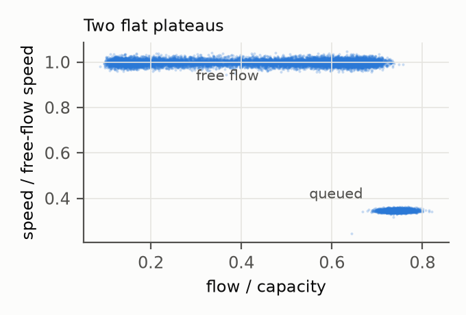
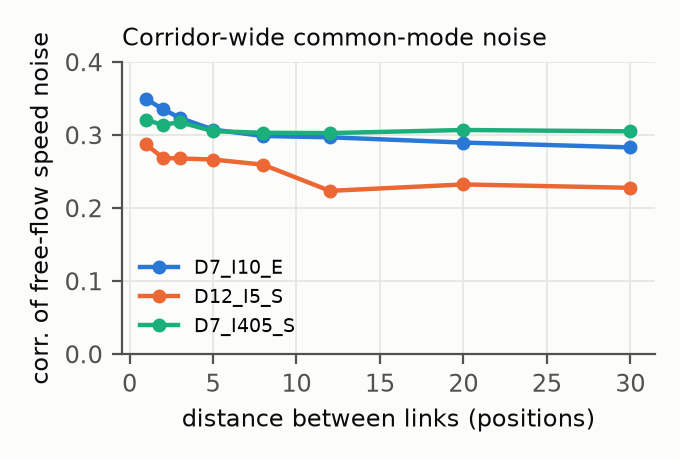
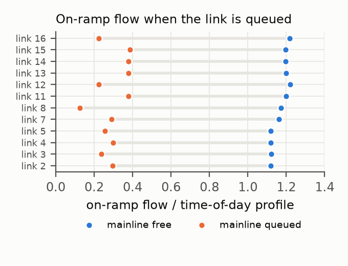
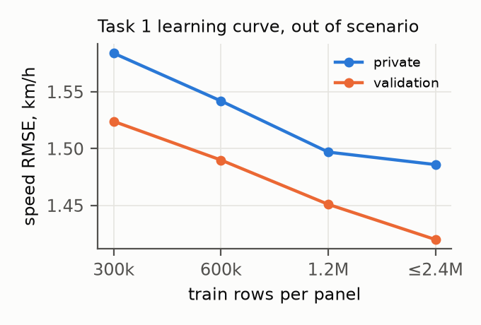

## 1. Summary

Validation (March) and private (April) are **new traffic scenarios**: the scenario seed is redrawn, so per-link free-flow
speeds, queued-speed levels, ramp demand and the bottlenecks that activate all change. A model that is validated only on
held-out training days cannot see this shift. Our solution is built around one discipline: **every change is accepted
only on out-of-scenario evidence**, measured on the published validation/private layers. We use them for evaluation only,
never for fitting a prediction. With that discipline in place, three structural findings carried most of the gain:

1. **Measurement noise has a corridor-wide common mode.** The free-flow branch of the generator's fundamental diagram is
   flat, so a free-flowing speed minus its link plateau is pure measurement noise. That noise shares a component across
   the whole corridor at each 5-minute slot, and the other links observed at the same slot estimate it.
2. **Scenario statistics must come from the scenario itself.** Plateaus and profiles measured on the training months
   plant a per-link bias in the new months. Measured on the split's own published layer (Task 1 is offline, so this is
   allowed), they remove about 0.3 km/h of speed RMSE out of scenario.
3. **Published layers carry sensors that were overlooked.** The masked layer publishes the Task 2 origin row T at about
   58% coverage. And on-ramp flow collapses while the mainline link it feeds is queued, while the ramp layer stays
   published inside the 90-minute mainline blackouts that follow each Task 2 origin.

From the inherited pipeline (public 0.87446) the final submission reaches **0.88107**. Our out-of-scenario evaluators
predicted the last two online deltas to within 0.0005.

## 2. Tasks, rules and validation

**Score.** S = 0.35·S_state + 0.30·S_queue + 0.15·S_physics + 0.20·S_ODME. Task 3 is computed from the Task 1 answer.

**Information sets.** We follow the organizers' ruling (forum topic 742068). Task 2 is online: a forecast may only use
released data with a timestamp at or before the origin T, in any file. Task 1 is offline: any released observation of
the split may be used. Our Task 2 inputs are the 60-minute window history, the masked-layer origin row at T, and the
same-day and earlier-day masked layer before T. Ramp values inside the horizon and mainline observations after the
post-horizon buffer are never read for Task 2.

**Out-of-scenario evaluators.**

* *Task 1, hidden cells.* We hide 3% of the observed eligible cells of validation/private (about 39k per panel-split)
  and rebuild every feature without them. This includes the split-own plateaus and profiles, so the hidden values never
  enter their own predictors. We then score the predictions against the published values (`tfb/t1_shift_eval.py`).
  Synthetic blackouts (all links blank for 18 slots) score the gap specialist the same way.
* *Task 2, mined events.* We take onset events and ongoing windows found in the validation/private masked layer and
  build their inputs exactly as at inference (`tfb/t2_onset_shift.py`, `tfb/t2_prod_shift.py`). Ongoing windows use
  the organizers' selector rule (persistence IoU ≤ 0.9).

**Adoption rule.** A paired gain of more than 2 standard errors. Both splits must be non-negative. At least half of the
changed panels must improve in both splits. The gain must survive dropping the best panel.

| Change | Predicted Δ | Online Δ | Evaluator |
|---|---|---|---|
| V10a → V12 | +0.004 … +0.0055 | **−0.0012** | train-day holdout (blind to the scenario shift) |
| V12 → V12b | +0.006 | **+0.0058** | out-of-scenario hidden cells |
| V12b → V13 | +0.0016 | **+0.0021** | out-of-scenario hidden cells |

The V12 miss is the reason for the protocol. Its Task 1 changes were right in the training scenario and wrong in the new
ones (Section 4.2). The out-of-scenario evaluator caught this, and its predictions now match the online deltas.

## 3. What the generator looks like

* **Two flat plateaus.** In free flow, v/v_f = 1.00 at every flow level (p10–p90 within ±1.5%). A queue sits at about
  0.30–0.35·v_f. There is no speed precursor of breakdown.
* **Queues appear as blocks.** Whole clusters of links switch on at once (for example links 4–10 of D7_I10_E). Before
  onset, the flow/capacity of the cluster that will queue is ordinary (0.5–0.7). The highest-flow links never queue.
* **Common-mode noise.** Free-flow speed noise has sd 0.8–1.75 km/h per panel and is nearly white in time (lag-1
  autocorrelation 0.06). It is correlated about 0.3 between links 1 *and* 30 positions apart. The common factor has sd
  0.46–1.09 km/h. Flow noise has no usable common mode.
* **Ramp sensor.** On-ramp inflow falls to 5–70% of its time-of-day profile while the mainline link it feeds is queued,
  and off-ramp flow rises about 10%.
* **Scenario shift.** Compared with train, per-link plateaus in validation/private move with sd about 1.3 km/h.
  Per-link queued-speed levels move with sd 1–6 km/h. Bottleneck clusters switch on or off; for example, D12_I5_S links
  43–45 queue on 89% of train days but 45% of March days, and the onset time of D12_I5_N moves from 12.4 h to 10.8 h.

<figure><figcaption><b>Figure 1.</b> Speed against flow for one link of D7_I10_E (train, 15k cells): a flat free-flow branch and a flat queued plateau, no breakdown precursor.</figcaption></figure><figure><figcaption><b>Figure 2.</b> Correlation of free-flow speed noise between links k positions apart (train). It stays near 0.3 up to 30 positions: a corridor-wide common mode.</figcaption></figure>

## 4. Task 1 — state reconstruction

### 4.1 Model

A LightGBM residual model is fitted over temporal linear interpolation: speed in km/h, and flow per lane. Features:
temporal/spatial interpolations, ±1/±2 neighbours, neighbour-difference estimates, time-of-day profiles,
local level relative to the profile, pct_observed and link attributes. On top of these:

* **Common mode.** cf_sp is the mean of (v − plateau) over the free-flowing links observed at the same slot. We also use
  a relative version, a ±5-link local version and the plateau itself. Only the speed model uses them; they did not help
  flow.
* **Split-own statistics.** Plateaus and the gap specialist's ramp and speed/flow profiles are measured on the split's
  own published masked layer.
* **Gap specialist.** Validation/private blank every link for T+5…T+90 after each Task 2 origin. Train has no such
  blackouts, so we place synthetic ones at onset and ongoing origins in train. A dedicated model is trained on the cells
  inside them, with ramp-ratio features: per-link on/off-ramp flow divided by its profile, temporal smoothing, ±2/±5-link
  windows, and the share of collapsed on-ramps nearby.
* **Capacity.** Out of scenario, the learning curve kept improving up to all train target cells (about 20M rows, with
  the matrix filled column-wise into one float32 array).

<figure><figcaption><b>Figure 3.</b> On-ramp flow relative to its time-of-day profile while the attached mainline link is free vs queued (D7_I405_S, train). The ramp layer stays published inside the Task 2 blackouts.</figcaption></figure><figure><figcaption><b>Figure 4.</b> Task 1 speed RMSE out of scenario (hidden cells of validation/private) against the number of training rows per panel.</figcaption></figure>

### 4.2 Results (out of scenario, hidden cells; RMSE, private / validation)

| Main model | speed (km/h) | flow (veh/h/lane) |
|---|---|---|
| inherited model (train profiles, no common mode) | 1.888 / 1.883 | 30.26 / 30.32 |
| + common mode, **train** plateau (V12) | 1.914 / 1.892 | 30.26 / 30.32 |
| + common mode, **split-own** plateau (V12b) | 1.584 / 1.524 | 30.26 / 30.32 |
| 600k rows/panel, 5000 rounds | 1.542 / 1.490 | 30.03 / 30.03 |
| 1.2M rows/panel | 1.497 / 1.451 | 29.82 / 29.82 |
| **all train targets (V13)** | **1.486 / 1.420** | **29.69 / 29.68** |

On true free-flow cells the final model reaches 1.145 km/h out of scenario. The ideal estimator "plateau + common mode"
reaches 1.152, so free flow is at the noise floor. The remaining speed error comes from queue-edge cells: cells that are
queued in time but not in space have RMSE 5–9.

| Gap specialist (synthetic blackouts) | speed | flow |
|---|---|---|
| without ramps | 6.32 / 6.50 | 68.3 / 68.9 |
| ramps, **train** ramp profile (V12) | 9.78 / 9.83 | 114 / 110 |
| ramps, split-own ramp + speed/flow profiles (V12b, V13) | **4.92 / 5.10** | **65.7 / 65.3** |

## 5. Task 3 — physical consistency

Task 3 is computed from the Task 1 answer: k = q/v and N = kL, and the conservation residual is taken against organizer
fluxes projected onto the observations. At a target cell with observed neighbours, the residual is about 2·|N error|.
N error is dominated by flow noise, about 2% of q, against about 1.2% for speed. A flux-based estimate cannot help
either: the 5-minute flux term dt·q is about 20 times N, so flow noise in the fluxes swamps it. The physics score therefore
follows Task 1 accuracy, mostly flow. The flow gains of the capacity steps add roughly +0.0006 through S_LWR.

## 6. Task 2 — queue forecasting

### 6.1 Onset

In every onset window the queue first appears at the last horizon step (T+30), on a cluster of bottleneck links.
The model has three parts:

* a cluster model for which cluster activates;
* a link model inside an active cluster;
* an unconditional link model.

Decoding draws joint Monte-Carlo samples and picks the set that maximizes expected IoU. The window history ends at T−5.
The origin-row-free refit gained +0.034 online.

### 6.2 Ongoing

The ongoing forecast is 0.5·LightGBM + 0.5·(mean of CNN seeds) per cell and horizon step, with threshold 0.5. The CNN
is a 1-D dilated residual network over links, taking 13 history steps × channels. The LightGBM uses per-cell features of
the queue geometry: distance to the head and tail, run lengths, the queue's movement over the last 6 slots,
up/downstream flows, and same-day pre-origin episode features. **Origin row:** the masked layer publishes row T at about
58% coverage, with only Task 1 targets blank. Training and inference both use it. Paired evaluation of the LightGBM
part: in scenario +0.0102 ± 0.0008, validation +0.0231 ± 0.0025, private +0.0211 ± 0.0026, 7/8 panels.

| Ongoing IoU, out of scenario (private / validation) | |
|---|---|
| inherited ongoing (no origin row) | 0.8813 / 0.8772 |
| LightGBM with origin row | 0.8863 / 0.8832 |
| CNN with origin row (2 seeds) | 0.8822 / 0.8876 |
| **blend (final)** | **0.8986 / 0.8980** |

A third CNN seed adds +0.0002 ± 0.0006, so the blend is saturated.

### 6.3 What limits onset

When the predicted cluster is right, onset IoU is 0.94–0.98; when it is wrong, 0.14–0.16. The wrong-cluster rate is 12%
in the training scenario and about 20% in the new ones. Onset IoU is 0.893 in scenario and 0.765 out of scenario. We
tested every causal source of scenario evidence; none passed the adoption rule (Section 8). Suppose every other
component sat at a generous ceiling simultaneously:

* S_state 0.954, all cells at the white-noise floor;
* S_physics 0.77;
* S_ODME 1.0;
* ongoing IoU 0.91.

Then the public prize zone (0.917) would still need onset IoU ≥ 0.872 in an unseen scenario.

## 7. Task 4 — OD and path-flow estimation

The link counts are noise-free. We take the L2 projection of the split's own weak prior b onto {A f = c, f ≥ 0}, solved
through its dual. It equals the organizers' ridge reference (NNLS, λ = 0.05) to within 0.04% L1. The relative L2
deviation from the prior reproduces five online points: L2, KL, a rescaled prior, a per-path shift and a pooled prior.
L2 is optimal under it. Every alternative was worse online, by 0.11 to 0.30 S_ODME.

## 8. What did not work (out of scenario unless stated)

* **Onset physics precursors** (flat diagram, flow/capacity): none exist.
* **Onset with ramp demand:** gained on mined events from one panel, then lost 0.009 online. This was small-sample luck.
* **Onset with prior-day evidence:** cluster day-rates, activation timing with 0–4 earlier days, and same-day early
  evidence. None was significant, and the splits disagreed.
* **Onset calibration** (temperature, shrinkage): validation and private disagreed.
* **Ramp features for the main Task 1 model:** mixed, 12/20 panels.
* **Queued-speed plateau feature:** worse, 6/20 panels.
* **Spatiotemporal CNN imputer for Task 1** (36-slot × corridor windows, factorised dilated convolutions): it fits the
  training scenario's spatial patterns and does not transfer. Out of scenario its flow RMSE is about 2× LightGBM's, and
  every blend weight was worse. The ongoing CNN with early-day channels failed the same way.
* **More ongoing CNN seeds:** saturated. Threshold 0.45: +0.0004 ± 0.0003 in scenario; not adopted.

## 9. Submission history (public leaderboard)

| Version | Change | Public |
|---|---|---|
| v1 | interpolation, persistence, L2 | 0.70508 |
| v2 | static onset set | 0.81819 |
| v3–v6 | LightGBM T1/T2, gap specialist, retuning, full-train T1 | 0.85566 → 0.86864 |
| v9b | onset cluster mixture, LightGBM + 4-seed CNN ongoing | 0.87104 |
| V10a | origin-row-free onset refit | 0.87446 |
| V12 | common mode + ramp gap (train statistics) + origin row | 0.87324 |
| V12b | split-own plateaus and profiles | 0.87900 |
| **V13** | **Task 1 on all train targets** | **0.88107** |

## 10. Reproducibility

`trafficflow/reproduce.sh` is the single entry point. It rebuilds V13 from the Kaggle release and the official toolkit
(CPU only: 4 cores, 15 GB RAM, about 8–9 hours). Every step caches its result and resumes after interruption.
Versions are in `trafficflow/requirements.txt`. Code is under Apache-2.0. No external data and no pretrained models.
